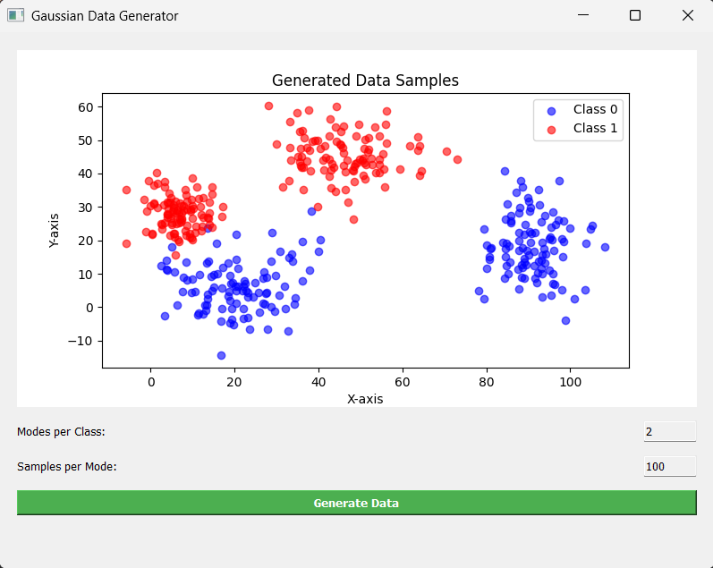
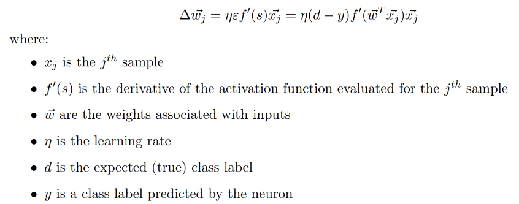
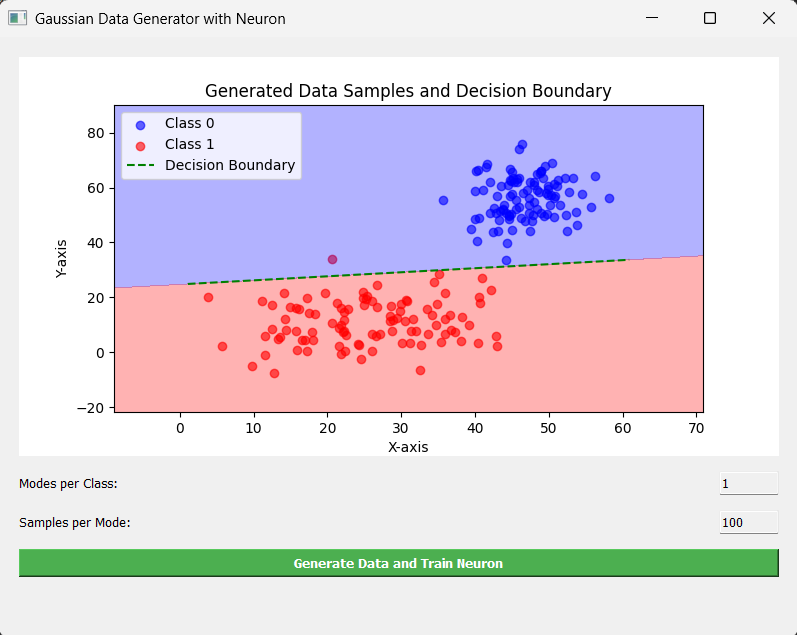
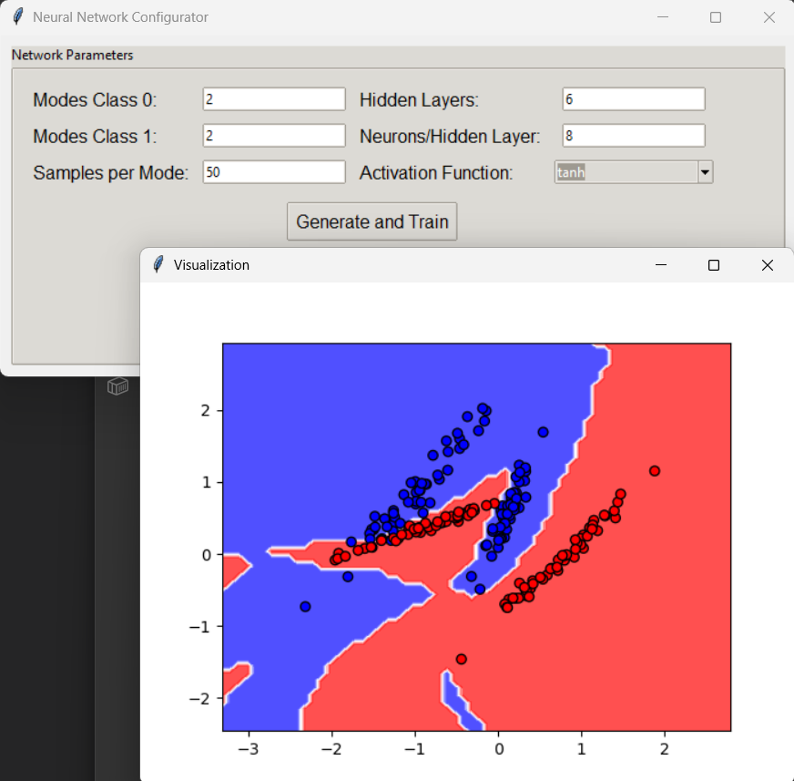
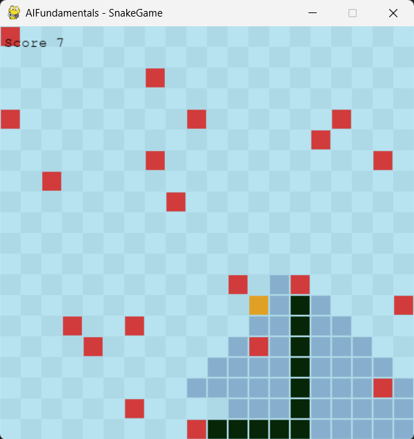
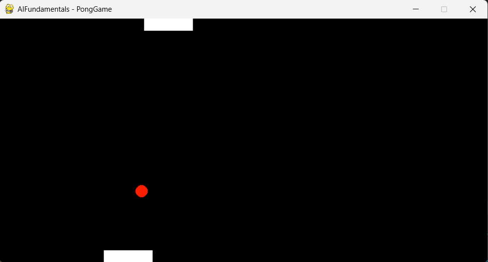

# Artificial Intelligence Fundamentals Tasks  
Understanding the behavior of a Single Neuron (Perceptron), Shallow Neural Networks, Search Algorithms, and Fuzzy Control  

# Task 1: Gaussian Data Generator

## 📌 Description

The program generates synthetic data simulating two distinct classes, each with multiple modes (distribution centers). Points are generated using a normal distribution with random means and variances for each mode. The results are dynamically displayed on an integrated plot using Matplotlib and PyQt5.

Blue points represent Class 0, and red points represent Class 1.

## 📸 Screenshot




# Task 2: Gaussian Data Generator with Single Neuron Training

## 📌 Description

The program generates synthetic data similar to Task 1, then trains a single neuron to separate the two classes. It visualizes the data points along with the neuron's decision boundary and background coloring indicating the classified regions.

Blue points represent Class 0, red points represent Class 1, and the green dashed line shows the neuron's decision boundary.

The perceptron receives all the coordinates as the input data, and one by one processes them. It makes a prediction on which class does it think this coordinate belong to. After that, the real label is compared to the prediction, and learning occurs (formula below)



## 📸 Screenshot




# Task 3: Shallow Neural Network

## 📌 Description

This program implements a shallow neural network that contains two types of layers: linear, and activation.


Linear layer has got 3 functions:
  - forward(self, input_data)
  - backward(self, output_error)
  - update_weights(self, input_data, lr)

The forward function computes the inputs with it's weights, and adds the bias.
The backward function calculates the error and returns it.
The update_weights function updates the parameters of the layer using the learning rate


Activation layer has got only forward and backward functions. The activation function can be chosen by the user:
  - Sigmoid
  - Tanh
  - ReLU


The number of layers, and neurons per layer can also be adjusted by the user.

## 📸 Screenshot




# Task 4: Search algorithms

## 📌 Description

This program implements the snake game, on autopilot mode. 4 different search algorithms are implemented:

  - BFS
  - DFS
  - A star
  - Dijkstra


In this code line, you can modify the algorithm that is being used by the snake:

```
ALGORITHM = "Dijkstra"  # This can be set to "BFS", "DFS", "Dijkstra", or "A*"
```

The squares in a darker blue tone are the squares that have been explored by the algorithm to find the path

## 📸 Screenshot




# Task 5: Fuzzy Control

## 📌 Description

This programe implements the classic Pong game, on autopilot mode, and human player. In comparison with the classic version, this implementation provides a different way of increasing the speed of the ball. If the ball is deflected using the 25% edgemost of the paddle, its speed increases by 10%.

3 different fuzzy models are implemented:
  - Mamdani
  - Takagi-Sugeno-Kang (TSK)
  - Mamdani with an extra functionality to hit the ball with the edge of the paddle (to increase the speed of the ball)

In this part of the code you can choose which strategy you want to use, or if you want to play as a human:

```
if __name__ == "__main__":
    game = PongGame(800, 400, NaiveOponent, HumanPlayer)

    # game = PongGame(800, 400, NaiveOponent, FuzzyPlayerMamdani)
    # game = PongGame(800, 400, NaiveOponent, FuzzyPlayerTSK)
    # game = PongGame(800, 400, NaiveOponent, FuzzyPlayerStrategy)
    game.run()
```

The 3 commented lines are for the 3 different strategies

## 📸 Screenshot



